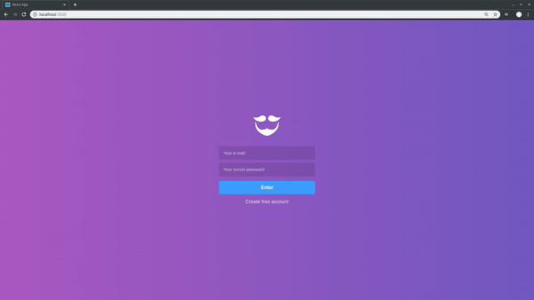
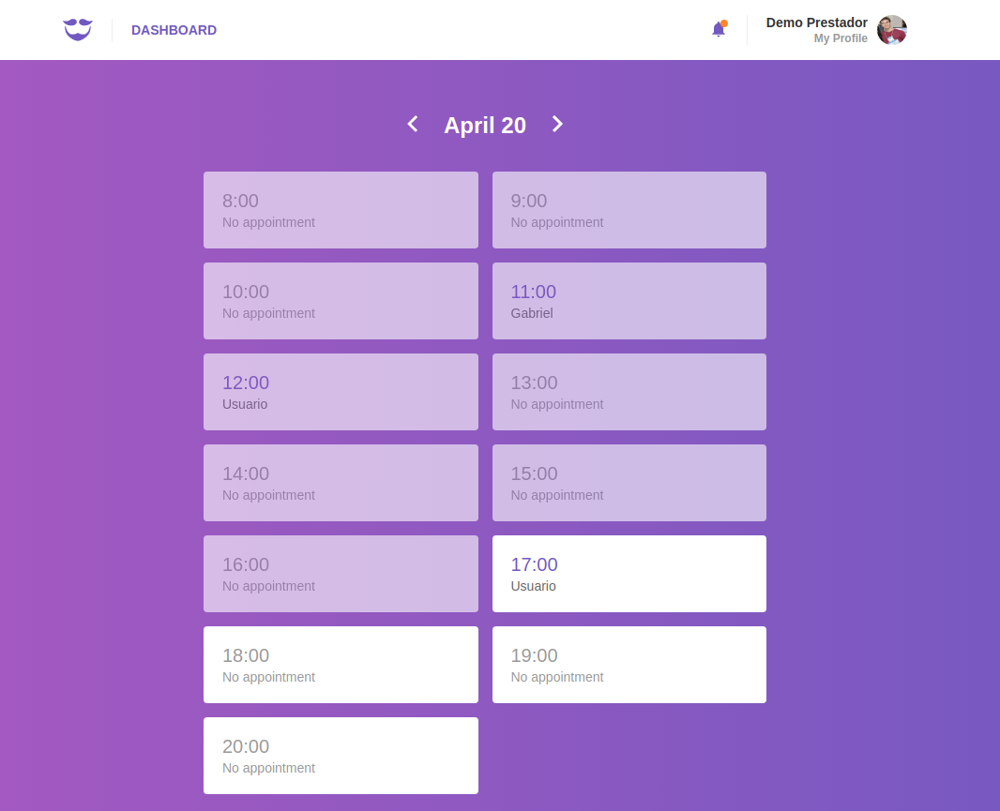

<h1 align="center">
  
 
 
GoBarber (web)
</h1>

 
Web (ReactJS) project of  barber shop scheduling app  :barber:, developed during <a href="https://rocketseat.com.br/">GoStack10 bootcamp</a>.
 
 

<h3 align="center">
:floppy_disk: Backend <a href="https://github.com/gabrielbarth/backend-goBarber">here</a>
 
:iphone: Mobile version <a href="https://github.com/gabrielbarth/mobile-goBarber">here</a>
</h3>

##  :mag_right:  Overview 

This application allows:

- barbers authentication and creating profile;
- update profile (including add profile image);
- see appointments per day;
- see notifications about new appointments;

##  :computer:  View of interfaces

   

### Dashboard screen

   

### Profile screen

   

##  :link: Project dependencies

:ballot_box_with_check: **<a href="https://pt-br.reactjs.org/">react</a>**     `// react lib`  
:ballot_box_with_check: **<a href="https://www.npmjs.com/package/react-icons">react-icons</a>**      `// allows to use icons from several libs`   
:ballot_box_with_check: <a href="https://date-fns.org/">**date-fns**</a>            `// node library to handle data`  
:ballot_box_with_check: **<a href="https://github.com/axios/axios">axios</a>**            `// Promise based HTTP client for the browser and node.js`   
:ballot_box_with_check: **<a href="https://styled-components.com/">styled-components</a>**            `// allows to write actual CSS code to style components`   
:ballot_box_with_check: **<a href="https://www.npmjs.com/package/prop-types">prop-types</a>**            `// used to document the intended types of properties passed to components`   
:ballot_box_with_check: **<a href="https://redux.js.org/">redux</a>**            `// allows manage app global state `   
:ballot_box_with_check: **<a href="https://github.com/redux-saga/redux-saga">redux-saga</a>**            `// allows manage app global state using middlewares (each other things) `   
:ballot_box_with_check: **<a href="https://github.com/infinitered/reactotron">reactotron-react-js</a>**            `// desktop app for inspecting informations through the app`   
:ballot_box_with_check: **<a href="https://github.com/infinitered/reactotron/blob/master/docs/plugin-redux.md">reactotron-redux</a>**            `// allow us observing using of middlewares in API requests `   
:ballot_box_with_check: **<a href="https://www.npmjs.com/package/react-dom">react-dom</a>**    `// allows to load react through <script> tag `  
:ballot_box_with_check: **<a href="https://www.npmjs.com/package/react-router-dom">react-router-dom</a>**         `// DOM bindings for React Router `  
:ballot_box_with_check: **<a href="https://github.com/immerjs/immer">immer</a>**     `// allows create the next immutable state by mutating the current one`  
:ballot_box_with_check: **<a href="https://polished.js.org/"> polished </a>**     `// a lightweight toolset for writing styles in JavaScript`  
:ballot_box_with_check: **<a href="https://github.com/ReactTraining/history"> history </a>**     `// allows manage session history with JavaScript`  
:ballot_box_with_check: **<a href="https://github.com/rt2zz/redux-persist">redux-persist</a>**     `// persist and rehydrate a redux store `  
:ballot_box_with_check: **<a href="">react-perfect-scrollbar</a>**     `// react wrapper for perfect-scrollbar`  
:ballot_box_with_check: **<a href="https://github.com/fkhadra/react-toastify">react-toastify</a>**     `// allows react notification easlily  `  
:ballot_box_with_check: **<a href="https://github.com/jquense/yup">yup</a>**     `// simple Object schema validation  `  
:ballot_box_with_check: **<a href="https://github.com/Rocketseat/unform">@rocketseat/unform</a>**     `// easy peasy highly scalable ReactJS & React Native forms  `  

#### Development libs / Bibliotecas de desenvolvimento utilizadas no projeto:  
:ballot_box_with_check: <a href="https://eslint.org/">**eslint**</a>    `// analyzes your code to quickly find problems`  
:ballot_box_with_check: <a href="https://prettier.io/">**prettier**</a>    `// code formatter (as the name says)`  
:ballot_box_with_check: <a href="https://github.com/timarney/react-app-rewired">**react-app-rewire**</a>   `// allows override create-react-app webpack configs without ejecting`  

## :computer: Running on your machine 

Consider the steps below to run this API on your machine browser:

**First step:** follow the steps presents on [backend project](https://github.com/gabrielbarth/backend-goBarber).

**Second step:** After configure servers on your machine, clone this repository.

1. Clone this repo using `git clone https://github.com/gabrielbarth/web-goBarber.git`.
2. Move to the appropriate directory: `cd web-goBarber`. 
3. Run `yarn` to install dependencies. 
4. Check if servers are running (as explained in first step). 
6. Run `yarn start` to run the app on your browser at `http://localhost:3000`.

### Any question?
Send an email to me: gabrielbarth98@gmail.com.

